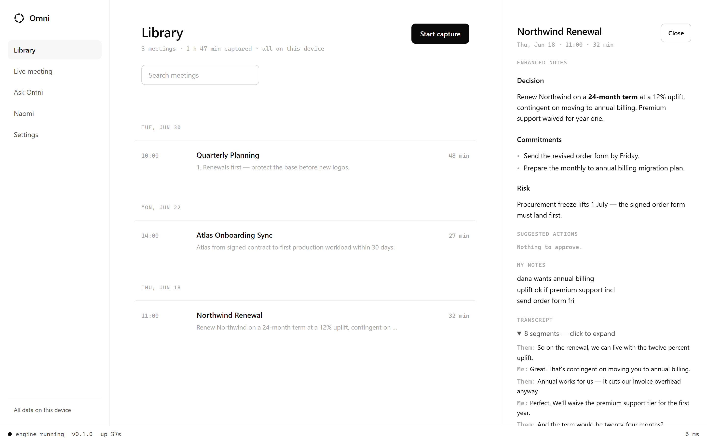
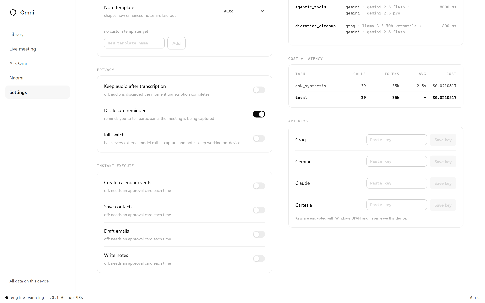
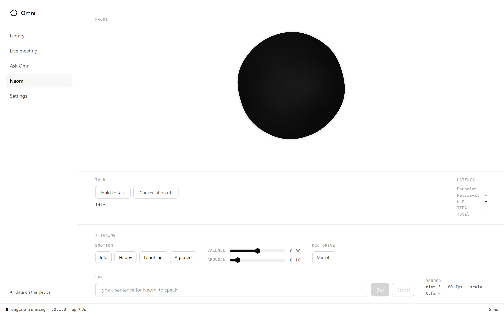
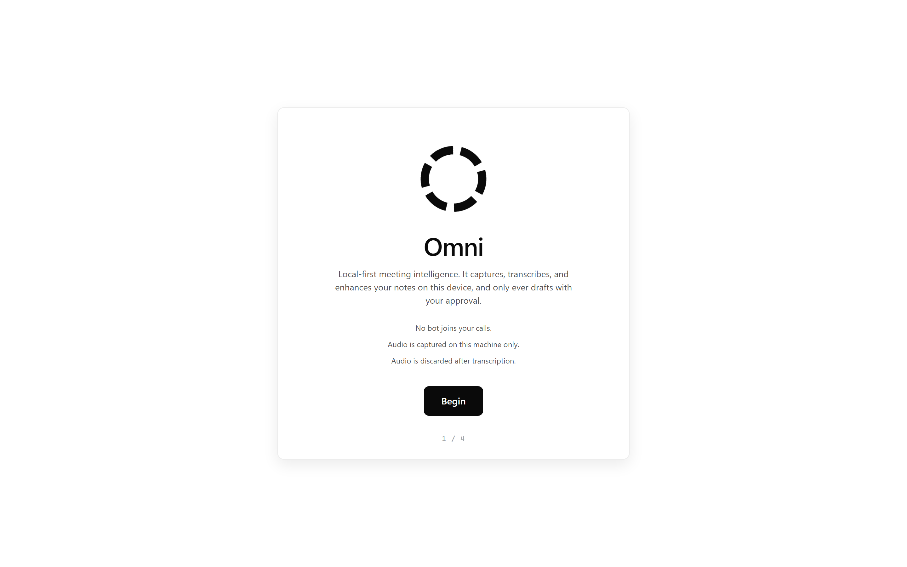
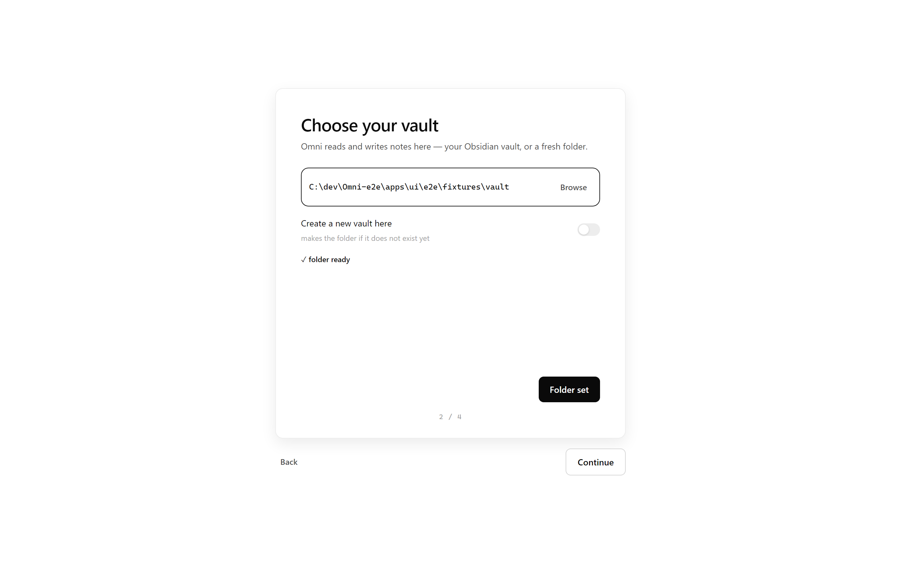
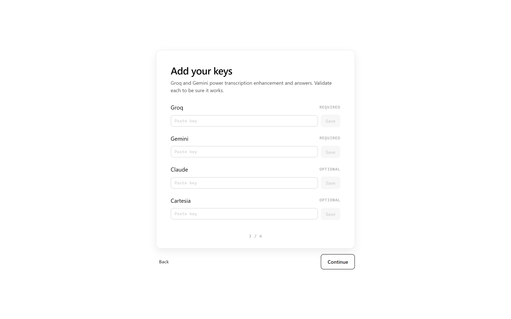

<div align="center">

# Omni

### Local-first, bot-free meeting intelligence for Windows.

Omni sits quietly on your machine, captures your meetings without a bot, transcribes them on-device, turns your rough notes into clean enhanced notes, answers questions from your own Obsidian vault, and drafts follow-up actions you approve with one click. Nothing leaves your machine unless you send it.

<br/>


<br/>

[](LICENSE)
[](#quick-start)
[](#privacy--security)
[](#privacy--security)
[](#proof-its-good)
[](https://github.com/AlexKapadia/omni/actions/workflows/ci.yml)

</div>

---

## What it is

Meeting tools today make you choose: let a bot join your call and upload everything to someone else's cloud, or take notes by hand. Omni refuses that trade. It runs entirely on your Windows machine, joins nothing, uploads nothing, and treats your Obsidian vault as the single source of truth.

- **Invisible, bot-free capture.** Omni records two clean, labelled streams — system audio via WASAPI loopback (the other participants, `them`) and your microphone (`me`) — so there is no bot in the call and it still works **through headphones**, where naive single-stream capture hears nothing.
- **On-device transcription.** Silero VAD gates a streaming Parakeet-TDT model on your GPU. The audio is **discarded after transcription** by default — keeping it is an explicit opt-in.
- **Enhanced notes, Granola-style.** Your rough in-meeting notes are fused with the transcript into structured notes. Your own words stay primary and untouched; the AI settles its lines *around* yours, inside clearly-marked managed regions.
- **Ask anything, live.** A local RAG index over your vault and every past transcript answers questions during and after a call — with **inline citations** that point at an exact note and line range, never at nothing.
- **Approval-carded actions.** Omni proposes calendar events, contact upserts, and **Gmail drafts — it never sends.** Nothing executes without your explicit approval, and every executed action lands in an append-only audit log.
- **Dictation, everywhere.** Global push-to-talk dictation that injects into any app, cleans up the transcript intelligently, and **retains the raw text** so a bad cleanup can never silently rewrite what you said.
- **Naomi — a voice agent.** A Jarvis-style voice mode with a reactive black-water visual that answers from your vault and dispatches the same approval-carded actions, hands-free.

Every capability above maps to a real screen below — real data, real citations, real cost ledger.

---

## Screenshots

> These are the **real app running end-to-end against the real Python engine** — real retrieval, real Gemini synthesis, real router ledger — not mock-ups. The one honest boundary: they are captured from the production web build in headless Chromium with a thin shim over the OS-native Tauri seams (folder picker, tray), so native window chrome isn't shown. Full capture notes: [`media/README.md`](media/README.md).

### Ask your vault — answers with exact citations


A real synthesized answer over the indexed vault. Every claim carries an inline citation; each source chip resolves to an exact note path and line range (`Meetings/Northwind Renewal.md · L11–13`). The footer shows engine-measured latency — retrieval in single-digit milliseconds.

### Your meetings, enhanced

<table>
<tr>
<td width="50%"></td>
<td width="50%"></td>
</tr>
<tr>
<td><b>Library</b> — every meeting grouped by day, with a live engine heartbeat in the footer.</td>
<td><b>Meeting detail</b> — enhanced notes woven around your verbatim notes, real transcript segments, and an honest "Nothing to approve" state.</td>
</tr>
</table>

### The AI router — bring your own keys, see every cent

<table>
<tr>
<td width="50%"></td>
<td width="50%"></td>
</tr>
<tr>
<td><b>Router matrix</b> — real device enumeration, hotkey, and per-task provider fallback chains (Groq → Gemini) with per-task budgets.</td>
<td><b>Cost ledger + keys</b> — privacy toggles, deny-by-default instant-execute, a real per-call cost/latency ledger, and DPAPI-masked keys.</td>
</tr>
</table>

### Naomi — voice, hands-free



The real living-water pool (WebGL, 60 fps) with the conversation and tuning panels. The pool renders its real idle water here; voice and affect are driven live in use.

### A two-minute first run

<table>
<tr>
<td width="25%"></td>
<td width="25%"></td>
<td width="25%"></td>
<td width="25%"></td>
</tr>
<tr>
<td align="center">Welcome</td>
<td align="center">Pick your vault</td>
<td align="center">Your keys</td>
<td align="center">Model download</td>
</tr>
</table>

---

## How it works

<div align="center">


</div>

A **deterministic local core** (capture, storage, approval, audit) with **learned layers on top** (STT, retrieval, synthesis):

- **Tauri 2 shell + React front end** renders state and relays commands. It never holds keys or does AI work.
- **Python engine sidecar** (PyInstaller-packed) does everything real, over a pinned WebSocket protocol on `127.0.0.1` only. `GET /health` reports liveness.
- **Tri-provider AI router** — **Groq** for instant work, **Gemini Flash** for long-context bulk, **Claude** *(optional)* for agentic tool use and synthesis. The router sends the minimum excerpt each task needs and records cost + latency for every call.
- **Local RAG** — Markdown is chunked and indexed with **BM25 + a dense `bge-small` tier**, fused with reciprocal-rank fusion, stored in `sqlite-vec`. All retrieval is on-device.
- **Keys via Windows DPAPI**, held only by the engine. Storage is SQLite plus your Obsidian vault. Model calls are the **only** egress, and a kill-switch halts them.

---

## Quick start

Omni is **bring-your-own-keys** — no backend, no accounts. It runs on your own API keys, and the keys you skip simply disable those features.

### Build from source

Prerequisites: **[uv](https://docs.astral.sh/uv/)** (Python toolchain — provisions Python 3.11 itself), **[pnpm](https://pnpm.io/)**, and the **Rust + MSVC** toolchain Tauri needs ([portable MSVC](https://tauri.app/start/prerequisites/) works if you can't run the full Visual Studio installer).

```bash
git clone https://github.com/AlexKapadia/omni
cd omni

# Engine — install deps (uv provisions Python 3.11)
uv sync

# Front end
cd apps/ui && pnpm install

# Run the whole app (Tauri boots the engine sidecar for you)
pnpm tauri dev
```

Prefer to run the pieces separately? `uv run python -m engine.server` starts just the engine (`GET http://127.0.0.1:8765/health` → `{"status":"ok"}`), and `pnpm dev` runs the UI against it.

<details>
<summary><b>Installer (from Releases)</b></summary>

<br/>

A one-click NSIS installer with auto-update is the intended distribution path. The **first tagged release is published separately** — until it lands, build from source with the steps above. When a release exists it will appear on the [Releases page](https://github.com/AlexKapadia/omni/releases).

</details>

### First run

A two-minute wizard walks you through it:

1. **Pick your Obsidian vault** — the folder Omni reads and writes.
2. **Enter your keys** (DPAPI-encrypted on the spot):

   | Provider | Unlocks | Required? | Free tier |
   | --- | --- | --- | --- |
   | **[Groq](https://console.groq.com/keys)** | Instant live answers, quick extraction | Recommended | Yes |
   | **[Google Gemini](https://aistudio.google.com/app/apikey)** | Long-context passes over full transcripts | Recommended | Yes |
   | **[Anthropic Claude](https://console.anthropic.com/settings/keys)** | Agentic tool use, high-quality synthesis | Optional | Paid |
   | **[Cartesia](https://play.cartesia.ai/)** | Naomi's voice | Optional | Yes |

3. **Download the on-device models** (VAD + transcription + embeddings).

With no keys at all, capture, transcription, and vault features still work fully offline.

---

## Privacy & security

This is the whole point, so it is stated plainly and enforced in code, not by convention:

- **Local-first.** Transcripts, embeddings, notes, and keys never leave your machine — except the minimum excerpts inside the model calls you configured.
- **Audio is never uploaded** and is **discarded after transcription** unless you opt in to keeping it.
- **Zero telemetry.** None. No phone-home, ever.
- **Your keys, DPAPI-encrypted.** Entered at onboarding, encrypted per Windows user, never written in plaintext, never logged. The UI process never holds them — only the engine does.
- **Gmail is draft-only.** Omni drafts; it never sends.
- **Approval-before-execute.** No calendar event, contact upsert, vault write, or draft happens without an approved card or a rule you explicitly whitelisted. Deny by default.
- **Kill-switch.** One flag halts all external calls; capture, transcription, and vault features keep working offline. It fails closed on egress, never on your own data.
- **Append-only audit log** of every executed action and every external model call: what, when, which provider, what data left the machine.
- **Untrusted input everywhere.** All transcript and document content is treated as untrusted at every model boundary (prompt-injection defence).

---

## Proof it's good

Omni ships with an [`evidence/`](evidence/) showcase — every number is a **real measurement of the real engine**, produced by a committed harness and regenerable from committed data.

| What | Measured result |
| --- | --- |
| **Retrieval latency** | p50 **0.78 ms**, p99 **1.92 ms** (n=1,375) — far under the 20 ms budget |
| **Retrieval scaling** | corpus ×53.7 (30 → 1,610 notes) → p50 latency ×3.6 (sub-linear) |
| **Ask citation exactness** | **1.000** over 55 answers — 0 hallucinated markers survived |
| **Dictation faithfulness guard** | accuracy **1.000**, 0 false-negatives over 1,020 adversarial cases |
| **Router cost** | Decimal-exact — 0 mismatches vs an independent rational cross-check |
| **Router, live** | 15 real provider calls, **$0.00080723** total, 0 fallbacks |
| **Determinism** | all 5 deterministic paths yield exactly 1 distinct output over repeated runs |
| **Test suite** | **2,766** cases (1,974 Python + 792 TypeScript); engine **98.87% line / 94.74% branch** coverage |

Tests are written to be **adversarial** — property-based, fuzzed, boundary-exact, determinism-checked — not happy-path. The suite is the evidence, not a rubber stamp.

**Honest caveats** (the full list is in [`evidence/README.md`](evidence/README.md)):

- **Dense retrieval isn't active on the measurement machine** — the `bge-small` weights are absent, so by the engine's fail-closed design retrieval collapses to **BM25 only**. Results are labelled accordingly; the paraphrase-query gap quantifies exactly what the dense tier recovers.
- **Engine coverage is 98.87% line / 94.74% branch** — measured with branch coverage, clearing the 90/85 gate. UI branch coverage clears 85%; UI line coverage is lower where WebGL/Canvas/Web-Audio rendering can only be exercised by the browser-driven E2E suite (jsdom can't run it), documented in [`evidence/coverage-report.md`](evidence/coverage-report.md).
- **All test data is synthetic** (no real PII, no private conversations), per the project's data rules.

---

## Contributing & license

Omni is open source under the [**MIT License**](LICENSE).

**Stack:** Tauri 2 (Rust) · React 18 · Python 3.11 (FastAPI + WebSocket) · SQLite + `sqlite-vec` · Silero VAD + Parakeet-TDT · Groq / Gemini / Claude.

The layout mirrors the data flow — `apps/ui/` (shell + front end), `engine/` (capture · stt · index · router · agents · vault · naomi · dictation), `evidence/` (the measured showcase). Issues and PRs welcome; run the checks (`uv run ruff check .`, `uv run mypy`, `uv run pytest`, and `pnpm test` in `apps/ui`) before opening one.

<sub>Built largely autonomously with Claude, under a strict test-, evidence-, and security-first operating contract. Every screenshot, number, and claim in this README is real and traceable to committed artifacts.</sub>
