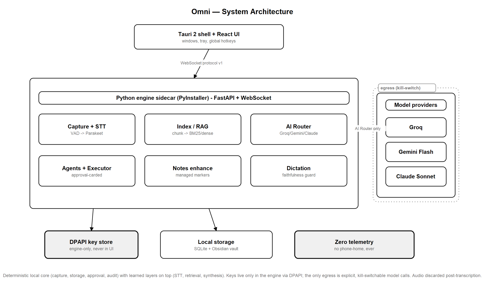

<!-- ─────────────────────────── HERO ─────────────────────────── -->


<div align="center">

### Local-first, bot-free meeting intelligence for Windows, macOS, and Linux.

Capture meetings without a bot. Transcribe on-device. Enhance your notes. Ask your vault with real citations. Approve every action — or nothing leaves the machine.

<br/>


[](https://github.com/bhaskaraanjana/omni-steroid/actions/workflows/ci.yml)

<br/>

<a href="#-see-it-in-action">
  
</a>
&nbsp;
<a href="#-quick-start">
  
</a>
&nbsp;
<a href="https://github.com/bhaskaraanjana/omni-steroid/releases">
  
</a>

</div>

---

## Table of contents

- [See it in action](#-see-it-in-action)
- [Features](#-features)
- [Built with](#️-built-with)
- [How it works](#-how-it-works)
- [Quick start](#-quick-start)
- [Privacy & security](#-privacy--security)
- [Proof it's good](#-proof-its-good)
- [Contributing & license](#-contributing--license)

---

## ✨ See it in action

> [!NOTE]
> Every image and the demo GIF below is the **real app running end-to-end against the real Python engine** — real retrieval, real Gemini synthesis, real router ledger — not mock-ups. Captured from the production web build with a thin shim over OS-native Tauri seams only. Full notes: [`media/README.md`](media/README.md).

<p align="center">
  
</p>

<p align="center">
  <sub>Recorded tour · Library → meeting detail → Ask with citations → Settings → Naomi<br/>
  Also available as <a href="media/omni-demo.mp4"><code>media/omni-demo.mp4</code></a> (~0.5 MB)</sub>
</p>

### Ask your vault — answers with exact citations

<p align="center">
  
</p>

A real synthesized answer over the indexed vault. Every claim carries an inline citation; each source chip resolves to an exact note path and line range. The footer shows engine-measured latency — retrieval in single-digit milliseconds.

### Your meetings, enhanced

<table>
  <tr>
    <td width="50%" align="center">
      
    </td>
    <td width="50%" align="center">
      
    </td>
  </tr>
  <tr>
    <td align="center"><b>Library</b><br/><sub>Meetings grouped by day · live engine heartbeat</sub></td>
    <td align="center"><b>Meeting detail</b><br/><sub>Enhanced notes around your words · honest empty approvals</sub></td>
  </tr>
</table>

### The AI router — bring your own keys, see every cent

<table>
  <tr>
    <td width="50%" align="center">
      
    </td>
    <td width="50%" align="center">
      
    </td>
  </tr>
  <tr>
    <td align="center"><b>Router matrix</b><br/><sub>Per-task provider chains · budgets · devices</sub></td>
    <td align="center"><b>Cost ledger + keys</b><br/><sub>Privacy toggles · real cost/latency · DPAPI keys</sub></td>
  </tr>
</table>

### Naomi — voice, hands-free

<p align="center">
  
</p>

The real living-water pool (WebGL, 60 fps) with conversation and tuning panels. Same approval-carded actions as the rest of the app — hands-free.

### A two-minute first run

<table>
  <tr>
    <td width="25%" align="center"></td>
    <td width="25%" align="center"></td>
    <td width="25%" align="center"></td>
    <td width="25%" align="center"></td>
  </tr>
  <tr>
    <td align="center"><sub>Welcome</sub></td>
    <td align="center"><sub>Pick your vault</sub></td>
    <td align="center"><sub>Your keys</sub></td>
    <td align="center"><sub>Model download</sub></td>
  </tr>
</table>

---

## 🚀 Features

Meeting tools today force a trade: let a bot join your call and upload everything, or take notes by hand. Omni Steroid refuses that. It runs on your machine, joins nothing, and treats your Obsidian vault as the source of truth.

| | Feature | What you get |
|--|---------|--------------|
| 🎧 | **Bot-free dual-stream capture** | WASAPI loopback (`them`) + mic (`me`) on Windows — works through headphones. macOS/Linux with BlackHole / PipeWire monitor. |
| 🧠 | **On-device transcription** | Silero VAD gates streaming STT — Parakeet-TDT live by default; Whisper & BYOK cloud STT for import/retranscribe. Audio kept on-device as MP3. |
| 📝 | **Enhanced notes** | Your rough notes fused with the transcript. Your words stay primary; AI settles around them in managed regions. |
| 🔍 | **Ask with citations** | Local RAG over vault + past transcripts. Inline citations to exact note path and line range. |
| ✅ | **Approval-carded actions** | Calendar events, contact upserts, **Gmail drafts — never send**. Nothing runs without your OK. Append-only audit log. |
| 🎙️ | **Global dictation** | Push-to-talk pill, locked recording, cleanup presets, inject into any app (Windows), searchable history. Raw text always retained. |
| 📦 | **Meeting tools** | Chat with a meeting, search-replace, export MD/PDF/DOCX/SRT/VTT, import audio with optional speaker ID. |
| 🌊 | **Naomi voice mode** | Hands-free voice agent over the same vault + approval cards — living-water visual. |

> [!TIP]
> **Windows is first-class** for full dual-stream capture. **macOS and Linux** ship as installable apps with mic capture and monitor-based loopback when you configure BlackHole or PipeWire.

Full catalog: [`docs/features.md`](docs/features.md).

---

## 🛠️ Built with

<p align="center">
  
</p>

<p align="center">


</p>

**AI & speech:** Silero VAD · Parakeet-TDT / Whisper · bge-small embeddings · Groq · Gemini Flash · Claude (optional) · BYOK (OpenAI, Ollama, OpenRouter, …)

---

## 🏗️ How it works

<div align="center">



</div>

A **deterministic local core** (capture, storage, approval, audit) with **learned layers on top** (STT, retrieval, synthesis):

- **Tauri 2 shell + React front end** renders state and relays commands. It never holds keys or does AI work.
- **Python engine sidecar** (PyInstaller-packed) does the real work over a pinned WebSocket on `127.0.0.1` only. `GET /health` reports liveness.
- **Pluggable STT** — Parakeet (fast), Whisper (accuracy), or OpenAI-compatible cloud STT; tier presets in Settings.
- **Tri-provider AI router** — Groq for instant work, Gemini Flash for long-context bulk, Claude *(optional)* for agentic tool use — plus BYOK paths. Minimum excerpts only; cost + latency recorded every call.
- **Local RAG** — Markdown chunked and indexed with BM25 + dense `bge-small`, fused with RRF, stored in `sqlite-vec`. All retrieval on-device.
- **Keys via Windows DPAPI**, held only by the engine. Model calls are the **only** egress; a kill-switch halts them.

Deeper dive: [`docs/architecture.md`](docs/architecture.md).

---

## ⚡ Quick start

Omni Steroid is **bring-your-own-keys** — no backend accounts. Keys you skip simply disable those features.

### Prerequisites

| Tool | Why |
|------|-----|
| **[uv](https://docs.astral.sh/uv/)** | Python toolchain (provisions 3.11) |
| **[pnpm](https://pnpm.io/)** | Front-end packages |
| **Rust** + platform toolchains | Tauri shell — [prerequisites](https://tauri.app/start/prerequisites/) (MSVC on Windows) |

### Build from source

```bash
git clone https://github.com/bhaskaraanjana/omni-steroid
cd omni-steroid

# Engine — install deps (uv provisions Python 3.11)
uv sync

# Front end
cd apps/ui && pnpm install

# Run the whole app (Tauri boots the engine sidecar for you)
pnpm tauri dev
```

Prefer separate processes?

```bash
# Terminal 1 — engine only
uv run python -m engine.server
# GET http://127.0.0.1:8765/health → {"status":"ok"}

# Terminal 2 — UI
cd apps/ui && pnpm dev
```

<details>
<summary><b>Installer (from Releases)</b></summary>

<br/>

Tagged releases build **Windows** (NSIS + MSI), **macOS** (DMG + `.app`), and **Linux** (deb + AppImage) via CI, with signature-verified auto-update. When a release exists it appears on the [Releases page](https://github.com/bhaskaraanjana/omni-steroid/releases). Until then, build from source. Packaging details: [`packaging/README.md`](packaging/README.md).

**macOS/Linux loopback:** configure a virtual monitor device (e.g. BlackHole on macOS, PipeWire monitor on Linux) for full meeting capture — see [`docs/architecture.md`](docs/architecture.md#cross-platform-status).

</details>

### First run

A two-minute wizard walks you through it:

1. **Pick your Obsidian vault** — the folder Omni Steroid reads and writes.
2. **Enter your keys** (DPAPI-encrypted on the spot):

   | Provider | Unlocks | Required? | Free tier |
   | --- | --- | --- | --- |
   | **[Groq](https://console.groq.com/keys)** | Instant live answers, quick extraction | Recommended | Yes |
   | **[Google Gemini](https://aistudio.google.com/app/apikey)** | Long-context passes over full transcripts | Recommended | Yes |
   | **[Anthropic Claude](https://console.anthropic.com/settings/keys)** | Agentic tool use, high-quality synthesis | Optional | Paid |
   | **[Cartesia](https://play.cartesia.ai/)** | Naomi's voice | Optional | Yes |

3. **Download the on-device models** (VAD + transcription + embeddings).

> [!IMPORTANT]
> With **no keys at all**, capture, transcription, and vault features still work fully offline. Cloud features simply stay disabled.

---

## 🔒 Privacy & security

This is the whole point — stated plainly and enforced in code, not by convention:

- **Local-first.** Transcripts, embeddings, notes, and keys never leave your machine — except the minimum excerpts inside the model calls you configured.
- **Audio is never uploaded.** Recordings are **kept on-device as MP3** with the transcript by default; you can opt out (discard after transcription) in Privacy. Either way, audio never leaves your machine.
- **Zero telemetry.** None. No phone-home, ever.
- **Your keys, DPAPI-encrypted.** Entered at onboarding, encrypted per Windows user, never plaintext, never logged. The UI process never holds them — only the engine does.
- **Gmail is draft-only.** Omni Steroid drafts; it never sends.
- **Approval-before-execute.** No calendar event, contact upsert, vault write, or draft without an approved card or a rule you explicitly whitelisted. Deny by default.
- **Kill-switch.** One flag halts all external calls; capture, transcription, and vault keep working offline. Fails closed on egress, never on your own data.
- **Append-only audit log** of every executed action and every external model call.
- **Untrusted input everywhere.** Transcript and document content treated as untrusted at every model boundary (prompt-injection defence).

Threat model: [`docs/threat-model.md`](docs/threat-model.md).

---

## 📊 Proof it's good

Omni Steroid ships with an [`evidence/`](evidence/) showcase — every number is a **real measurement of the real engine**, regenerable from committed data.

| What | Measured result |
| --- | --- |
| **Retrieval latency** | p50 **0.78 ms**, p99 **1.92 ms** (n=1,375) — far under the 20 ms budget |
| **Retrieval scaling** | corpus ×53.7 (30 → 1,610 notes) → p50 latency ×3.6 (sub-linear) |
| **Ask citation exactness** | **1.000** over 55 answers — 0 hallucinated markers survived |
| **Dictation faithfulness guard** | accuracy **1.000**, 0 false-negatives over 1,020 adversarial cases |
| **Router cost** | Decimal-exact — 0 mismatches vs an independent rational cross-check |
| **Router, live** | 15 real provider calls, **$0.00080723** total, 0 fallbacks |
| **Determinism** | all 5 deterministic paths yield exactly 1 distinct output over repeated runs |
| **Test suite** | **2,853** cases (2,028 Python + 825 TypeScript); coverage gates line ≥ 90% / branch ≥ 85% on engine |

Tests are **adversarial** — property-based, fuzzed, boundary-exact, determinism-checked. The suite is the evidence, not a rubber stamp.

**Honest caveats** (full list in [`evidence/README.md`](evidence/README.md)):

- **Dense retrieval isn't active on the measurement machine** — `bge-small` weights absent, so retrieval collapses to **BM25 only** by fail-closed design.
- **Engine coverage is 98.87% line / 94.74% branch** — clears the 90/85 gate. UI branch ≥ 85%; UI line lower where WebGL/Canvas needs browser E2E.
- **All test data is synthetic** — no real PII, no private conversations.

---

## 🤝 Contributing & license

Omni Steroid is open source under the [**MIT License**](LICENSE).

Issues and PRs welcome. See [CONTRIBUTING.md](CONTRIBUTING.md) for the full gate:

```bash
uv run ruff check .
uv run mypy
uv run pytest
cd apps/ui && pnpm test
```

**Layout** mirrors the data flow:

| Path | Role |
|------|------|
| `apps/ui/` | Tauri shell + React front end |
| `engine/` | Capture · STT · index · router · agents · vault · Naomi · dictation · enhance · export |
| `evidence/` | Measured showcase (numbers, diagrams, figures) |
| `docs/` | [Architecture](docs/architecture.md) · [features](docs/features.md) · [design](docs/design/) · [threat model](docs/threat-model.md) |
| `media/` | Real product screenshots + demo recording |

Also: [CODE_OF_CONDUCT.md](CODE_OF_CONDUCT.md) · [SECURITY.md](SECURITY.md)

---

<sub>Built largely autonomously under a strict test-, evidence-, and security-first operating contract. Every screenshot, number, and claim in this README is real and traceable to committed artifacts.</sub>


