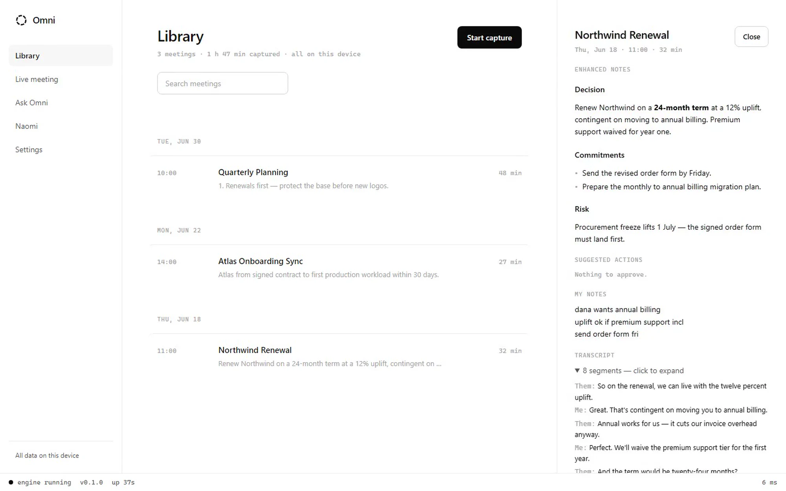
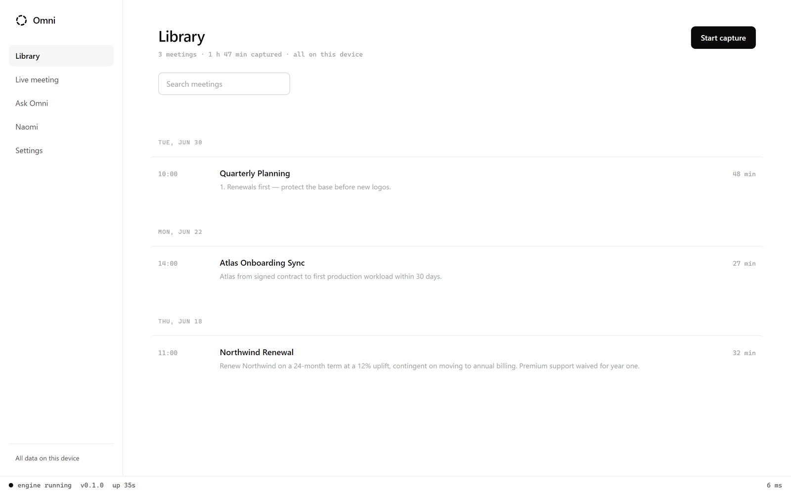
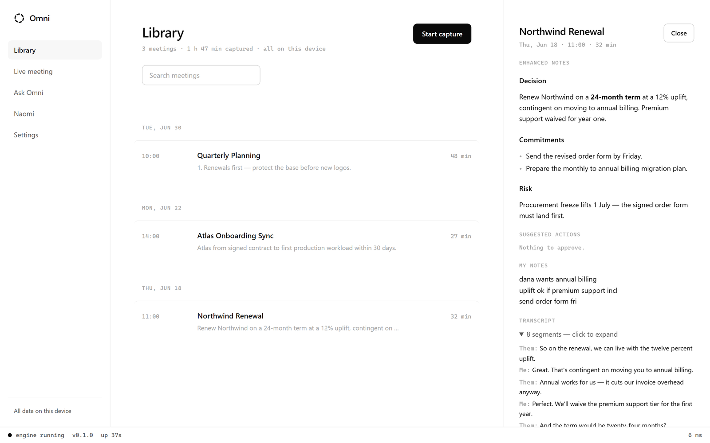
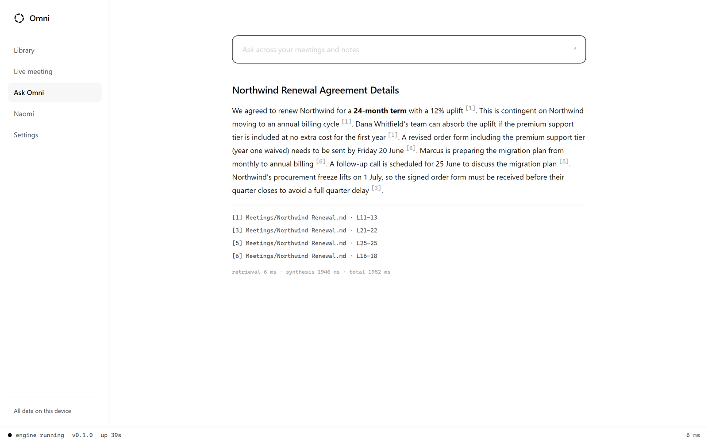
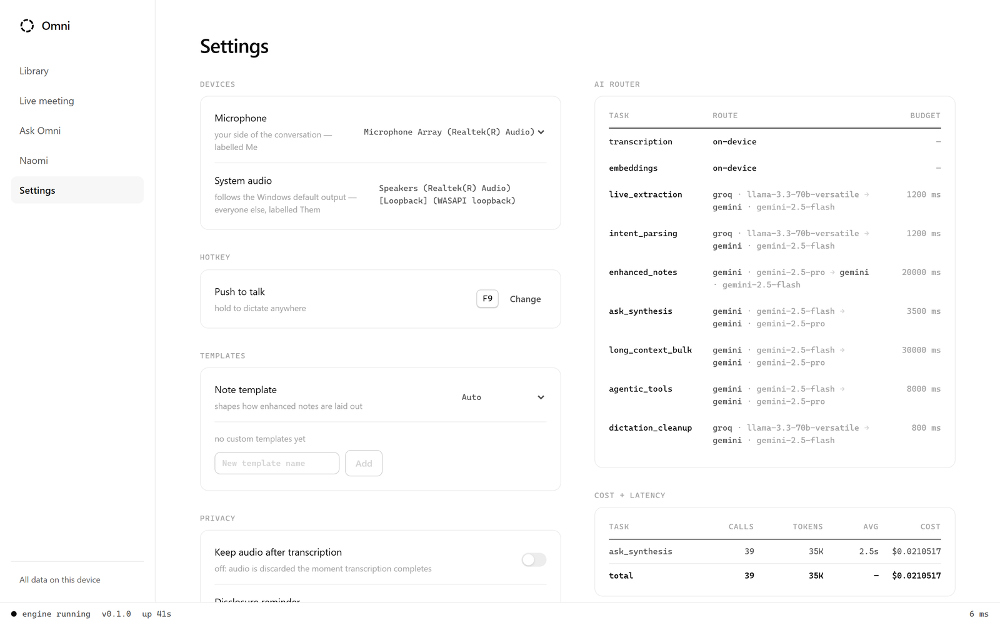
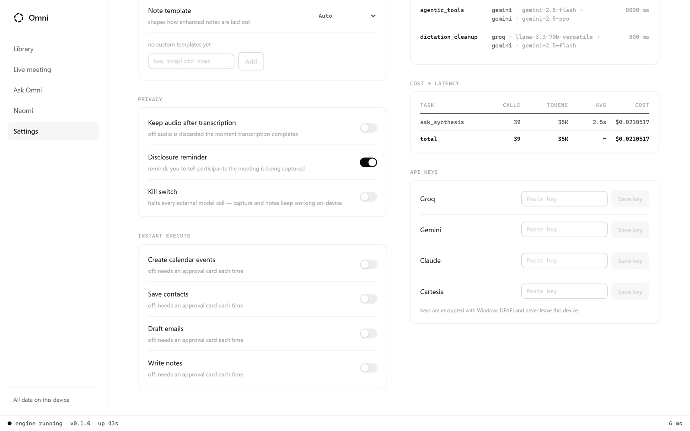
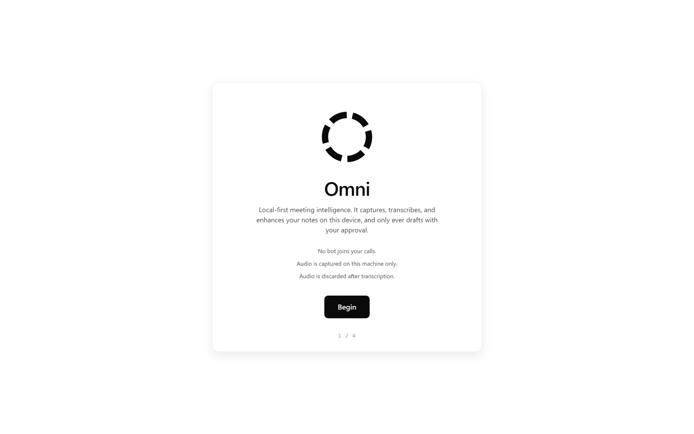
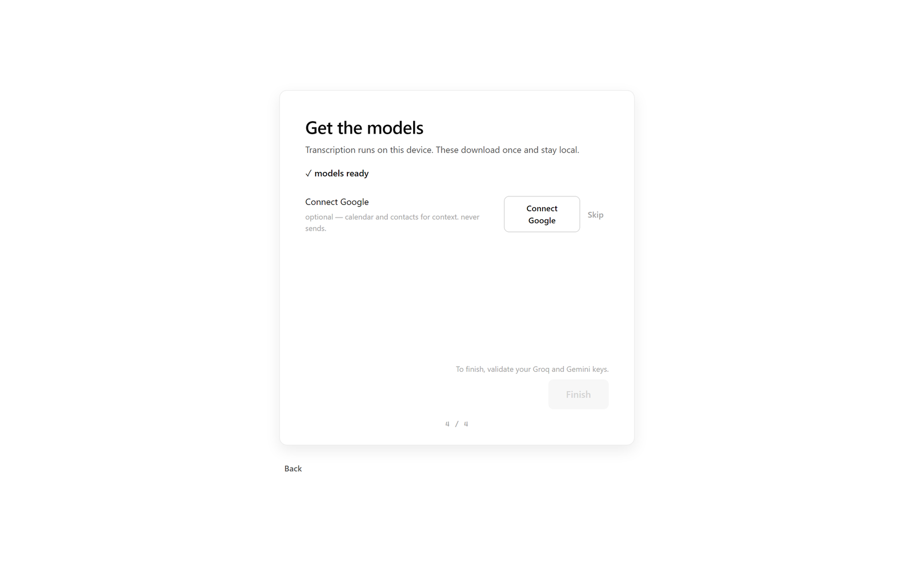

<!-- ─────────────────────────── HERO ─────────────────────────── -->


<div align="center">

### Local-first meeting intelligence — no bot in the call, no cloud by default.

Capture dual audio streams on your machine. Transcribe on-device. Turn rough notes into clean enhanced notes. Ask your vault with real citations. Approve every action before it runs.

<br/>


[](https://github.com/bhaskaraanjana/Omni-Steroid/actions/workflows/ci.yml)

<br/>

<a href="#-see-it-in-action">
  
</a>
&nbsp;
<a href="#-quick-start">
  
</a>
&nbsp;
<a href="https://github.com/bhaskaraanjana/Omni-Steroid/releases">
  
</a>

</div>

---

## ✨ See it in action

<p align="center">
  
</p>

<p align="center">
  
</p>

<p align="center">
  <sub>Recorded product tour · also as <a href="assets/readme/demo.mp4"><code>assets/readme/demo.mp4</code></a></sub>
</p>

> [!NOTE]
> Screenshots and the demo are the **real desktop app** running against the **real engine** — not mockups. Capture notes: [`media/README.md`](media/README.md).

### Library & meetings

<table>
  <tr>
    <td width="50%" align="center">
      
    </td>
    <td width="50%" align="center">
      
    </td>
  </tr>
  <tr>
    <td align="center"><em>Library — meetings by day, search, one-click capture</em></td>
    <td align="center"><em>Meeting — enhanced notes around your words, transcript, approvals</em></td>
  </tr>
</table>

### Ask with citations

<p align="center">
  
</p>

<p align="center"><em>Answers over your vault and past meetings — every claim cites a note path and line range</em></p>

### Your keys, your router

<table>
  <tr>
    <td width="50%" align="center">
      
    </td>
    <td width="50%" align="center">
      
    </td>
  </tr>
  <tr>
    <td align="center"><em>Bring-your-own keys · per-task provider chains</em></td>
    <td align="center"><em>Privacy controls · cost ledger · DPAPI-protected keys</em></td>
  </tr>
</table>

### Naomi voice mode

<p align="center">
  
</p>

<p align="center"><em>Hands-free vault Q&amp;A and action prep — same approval rules as the rest of the app</em></p>

### First run

<table>
  <tr>
    <td width="25%" align="center"></td>
    <td width="25%" align="center"></td>
    <td width="25%" align="center"></td>
    <td width="25%" align="center"></td>
  </tr>
  <tr>
    <td align="center"><sub>Welcome</sub></td>
    <td align="center"><sub>Vault</sub></td>
    <td align="center"><sub>Keys</sub></td>
    <td align="center"><sub>Models</sub></td>
  </tr>
</table>

---

## 🚀 Features

| | Feature | Description |
|--|---------|-------------|
| 🎧 | **Bot-free capture** | Dual labelled streams — system audio (`them`) + mic (`me`). Works with headphones on Windows (WASAPI). macOS/Linux via monitor devices (BlackHole / PipeWire). |
| 🧠 | **On-device STT** | Silero VAD + streaming transcription (Parakeet-TDT live; Whisper / BYOK cloud for import & retranscribe). Audio stays as local MP3 by default. |
| 📝 | **Enhanced notes** | Your rough notes stay primary. AI fills structure *around* them in clearly marked managed regions. |
| 🔍 | **Ask + citations** | Local RAG over Obsidian vault + transcripts. Inline citations to exact note + line range — never floating claims. |
| ✅ | **Approval cards** | Calendar, contacts, vault writes, **Gmail drafts only (never send)**. Nothing executes without you. |
| 🎙️ | **Global dictation** | Push-to-talk pill, locked recording, cleanup styles, inject into any app (Windows), searchable history. Raw text always kept. |
| 📦 | **Export & import** | Markdown, PDF, DOCX, SRT, VTT. Import audio/video; optional speaker identity. |
| 🌊 | **Naomi** | Voice agent over the same vault and approval path — hands-free between meetings. |

> [!TIP]
> **Privacy is the product.** Zero telemetry. Transcripts, embeddings, and keys stay on your machine except the minimum excerpt you send to a model you configured. One kill-switch pauses all cloud AI; capture and vault keep working offline.

Full catalog: [`docs/features.md`](docs/features.md).

---

## 🛠️ Built with

<p align="center">
  
</p>

<p align="center">


</p>

**Desktop shell:** Tauri 2 + React · **Engine sidecar:** Python FastAPI over localhost WebSocket · **Storage:** SQLite + `sqlite-vec` + your Obsidian vault · **Speech:** Silero VAD, Parakeet / Whisper · **Models (BYOK):** Groq, Gemini, Claude, OpenAI-compatible, Ollama, …

Architecture notes: [`docs/architecture.md`](docs/architecture.md).

---

## ⚡ Quick start

### Prerequisites

| Tool | Purpose |
|------|---------|
| [uv](https://docs.astral.sh/uv/) | Python 3.11 toolchain for the engine |
| [pnpm](https://pnpm.io/) | UI packages |
| [Rust](https://tauri.app/start/prerequisites/) | Tauri shell (MSVC on Windows) |

### From source

```bash
git clone https://github.com/bhaskaraanjana/Omni-Steroid.git
cd Omni-Steroid

uv sync

cd apps/ui
pnpm install
pnpm tauri dev
```

Tauri starts the engine sidecar for you. Health check when running standalone:

```bash
uv run python -m engine.server
# → GET http://127.0.0.1:8765/health
```

UI only (engine already up): `cd apps/ui && pnpm dev`

### First run (about two minutes)

1. Point Omni Steroid at your **Obsidian vault**
2. Add **API keys** you want (all optional — skip what you don’t need):

   | Key | Unlocks | Free tier |
   |-----|---------|-----------|
   | [Groq](https://console.groq.com/keys) | Fast live answers | Yes |
   | [Gemini](https://aistudio.google.com/app/apikey) | Long-context synthesis | Yes |
   | [Anthropic](https://console.anthropic.com/settings/keys) | Agentic / high-quality synthesis | Paid |
   | [Cartesia](https://play.cartesia.ai/) | Naomi voice | Yes |

3. Download **on-device models** (VAD, STT, embeddings)

> [!IMPORTANT]
> With **no keys**, capture, transcription, and vault still work fully offline. Cloud features stay off until you add a key.

### Installers

Tagged releases ship **Windows** (NSIS/MSI), **macOS** (DMG), and **Linux** (deb/AppImage) with signature-verified auto-update when published:

**→ [github.com/bhaskaraanjana/Omni-Steroid/releases](https://github.com/bhaskaraanjana/Omni-Steroid/releases)**

Packaging details: [`packaging/README.md`](packaging/README.md).

---

## 🔒 Privacy by design

| Guarantee | How |
|-----------|-----|
| Local-first | Transcripts, embeddings, notes, and keys stay on-device except minimum model excerpts you opt into |
| No audio upload | Recordings kept as local MP3 with the transcript (or discarded after STT if you opt out) |
| Zero telemetry | No analytics, no phone-home |
| DPAPI keys | Entered at onboarding; engine-only; never plaintext on disk |
| Approve before execute | Calendar / contacts / vault / Gmail draft — deny by default |
| Gmail draft-only | Never sends mail |
| Kill-switch | Halts all external model calls; local features continue |
| Audit log | Append-only record of every external call and executed action |

Threat model: [`docs/threat-model.md`](docs/threat-model.md).

---

## 📦 Repo map

| Path | What lives there |
|------|------------------|
| `apps/ui/` | Tauri shell + React UI |
| `engine/` | Capture, STT, index/RAG, router, agents, vault, Naomi, dictation |
| `assets/readme/` | Product images used on this page |
| `media/` | Full showcase media + capture notes |
| `docs/` | Architecture, features, design, plans |
| `evidence/` | Measured benchmarks and diagrams |
| `tests/` | Engine + UI test suites |

---

## 🤝 Contributing

Contributions welcome. Before a PR, run the gate:

```bash
uv run ruff check .
uv run mypy
uv run pytest
cd apps/ui && pnpm test
```

See [CONTRIBUTING.md](CONTRIBUTING.md), [CODE_OF_CONDUCT.md](CODE_OF_CONDUCT.md), and [SECURITY.md](SECURITY.md).

## 📄 License

Released under the [MIT License](LICENSE).


